 <br/>
Repository for the University Stuttgart "Fachpraktikum"
Join Meetings with this Link: https://jitsi-meet.fmi.uni-stuttgart.de/AlgLabCourseMeetingSS20

The goal of the project was to build a route planner for sea navigation. 

# Table of Contents
- [Manual](#Manual)
    - [Requirements](#Requirements)
    - [How to build](#How-to-build)
    - [How to run](#How-to-run)
- [Performance analysis](#Performance-analysis)
    - [Analysis conditions](#Analysis-conditions)
    - [Analysis explanation](#Analysis-explanation)
    - [Benchmark values](#Benchmark-values)
        - [Run 1 (500.000 nodes)](#Run-1)
        - [Run 2 (2.000.000 nodes)](#Run-2)
        - [Run 3 (8.000.000 nodes)](#Run-3)
    - [Discussion](#Discussion)
    - [Conclusion](#Conclusion)

- [Project requirements](#Project-requirements)

- [Sources](#Sources)
# Manual
## Requirements
OS: Windows 10, Linux<br/>
RAM: 16gb <br/>
- an installed [JDK](https://www.oracle.com/de/java/technologies/javase/javase-jdk8-downloads.html) with at least Java 8+
- an installed maven for build on console

Remark: The code was tested under Windows and Windows subsystem for linux and should work. MacOS was not tested

## How to build

### build with Intellij
- Import the project into [IntelliJ Community Edition](https://www.jetbrains.com/de-de/idea/download/#section=windows)
  - ***[optional Steps for grid graph generation]***
    - Go to the VM-options of the main method and add -Xmx8192m as a parameter or higher to allow the projekct to allocate enough ram during grid graph generation
        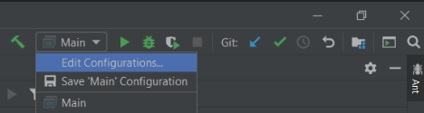
    <br/>
        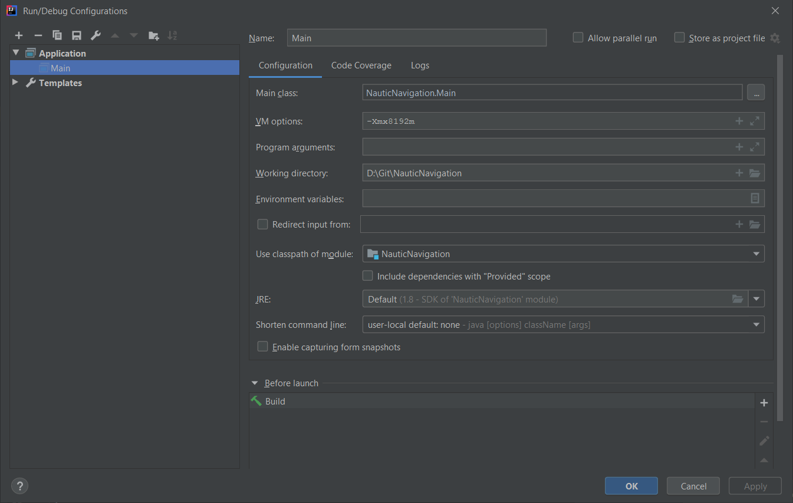
    <br/> 

    - Store the PBF-files in the ***./OSMMapData*** folder
        - ***all files need to end on ".pbf"*** to be detected by the filereader in the backend 
- Build and run the Main method in the ***Main.java*** file

### Build with maven
- run ```mvn clean install```
    - this should build the whole project and create a jar file in the main directory

## How to run
- Simply start the .bat file on Windows or use the .sh on MacOS or Linux

- There are three modes available:
    - [0] Generate new grid graph and start webserver
        - can be used to generate a new grid graph
        - follow the dialog to generate a new grid graph and start a webserver
    - [1] use pre generated one and start webserver
        - starts the webserver instantly using a pre generated grid graph
        - simply select the cache file to load, the first number of the filename represents the node count
            - 3 Files are available
                - 500k nodes
                - 2m nodes
                - 8m nodes
    - [2] start benchmarking mode: 
        - the tool that was used to generate the performance measurements
- Wait until the Frontend is booted up (takes a second with pre generated gridgraph)
- Open the ```NauticNavigation.html``` located in **/Fronted** in your Browser
    
     

- Start- and endnode can be either set by
    - interactively by clicking on the map
        - nodes are set alternately on the map
        - the node to set can be switched manually by hitting the set button
    - manually by providing a latitude and longitude in the fields and confirming the coordinate by pressing the check button
- if both coordinates are set and confirmed the Calculate route button unlocks
- during route calculation the check buttons as well as the calculate buttons stay inactive

<br/>
    
# Performance analysis
The protocols of the Benchmarks are located in the ***./BenchmarkData*** Folder.
The size equals the Grid graph node count that was used.

<span style="color:red">Time measurements in the tables are always provided in seconds!</span>

### Analysis conditions
- All Benchmarks got performed by the Benchmark class in the projekt.
- A Laptop with power supply plugged in was used
    - RAM: 16 gb ddr4
    - CPU: i5 6200U @2.4 ghz
    - OS: Windows 10
    - using JRE 8

### Analysis explanation
 - ***Time speedup***: average astar time/avg. dijkstra time
 - ***Nodes used less***: average astar Nodes / avg. dijkstra nodes
 - ***t dijkstra avg.***: average time per dijkstra calculation
 - ***t astar avg.***: average time per astar calculation
 - ***total dijkstra***: total amout of nodes that have been pulled out of heap for all dijkstra runs
 - ***total astar***: total amout of nodes that have been pulled out of heap for all astar runs
 - ***Average all*** All runs are considered
 - ***Average found*** Only runs where a route was found are used for analysis (this is mainly used because a star cant perform any better if no route can be found)


The performance analysis is split into three parts using different grid graph resolutions. Every part shows the overall average of the **dijkstra** and **astar** calculations as well as the parameters for the **best**, **worst** and **median** case with a picture of the route that has been calculated.

<br/>

## Benchmark values
Consider the **.csv** files to access the raw data aquired

---

### Run 1
**(1000 runs, 500.000 grid graph nodes)**<br/>
source (1000runs,grid_size=500000,date=18.09;19.01.csv)
| Analysis      |              |                  |   |                 |              |                 |              |                  |               |
|---------------|--------------|------------------|---|-----------------|--------------|-----------------|--------------|------------------|---------------|
|               | Time speedup |  Nodes used less |   | t dijkstra avg. | t astar avg. |  total dijkstra |  total astar |  dijkstra routes |  astar routes |
| Average all   | 2.73616507   | 0.17531607       |   | 0.53736895      | 0.19639493   | 2557982         | 448455       | 1000             | 1000          |
|               |              |                  |   |                 |              |                 |              |                  |               |
| Average found | 2.82310778   | 0.16944788       |   | 0.54061034      | 0.19149476   | 2573363         | 436050       | 987              | 987           |
 
<br/>

### Best Case A star (in terms of node pulls)

| start lat |  start   long |  dest   lat |  dest   long |  dijkstra time |  astar   time |  dijsktra node pulls |   astar   node pulls |  dijkstra found |  astar   found |  index |
|-----------|---------------|-------------|--------------|----------------|---------------|----------------------|----------------------|-----------------|----------------|--------|
| 5.22      | -21.42        | 41.22       | -21.42       | 0.5342578      | 0.0011721     | 2573363              | 101                  | true            | true           | 671    |

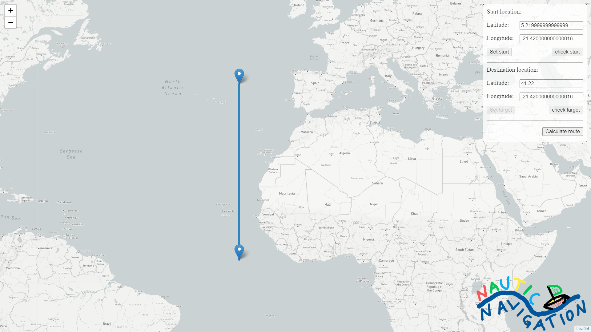
 <br/>

<br/>

### Worst case A star (in terms of node pulls)

| start lat |  start   long |  dest   lat |  dest   long |  dijkstra time |  astar   time |  dijsktra node pulls |   astar   node pulls |  dijkstra found |  astar   found |  index |
|-----------|---------------|-------------|--------------|----------------|---------------|----------------------|----------------------|-----------------|----------------|--------|
| -59.58    | -153.9        | 75.78       | 42.66        | 0.5364174      | 1.2640244     | 2573363              | 2195931              | true            | true           | 780    |

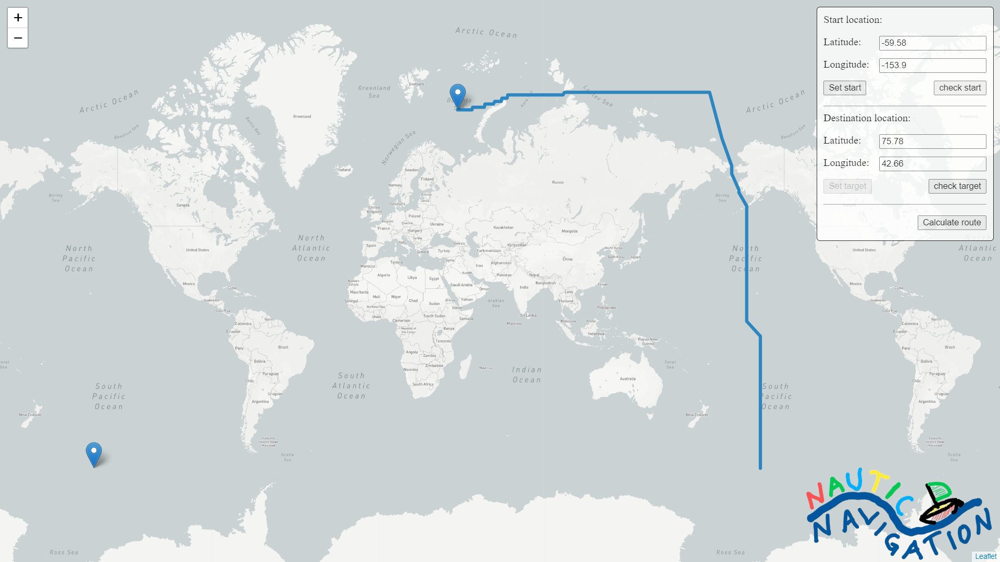
 <br/>


<br/>

### Median of A star (in terms of node pulls)

| start lat |  start   long |  dest   lat |  dest   long |  dijkstra time |  astar   time |  dijsktra node pulls |   astar   node pulls |  dijkstra found |  astar   found |  index |
|-----------|---------------|-------------|--------------|----------------|---------------|----------------------|----------------------|-----------------|----------------|--------|
| -5.22     | 173.7         | -40.86      | 78.66        | 0.5276572      | 0.1196866     | 2573363              | 295116               | true            | true           | 722    |

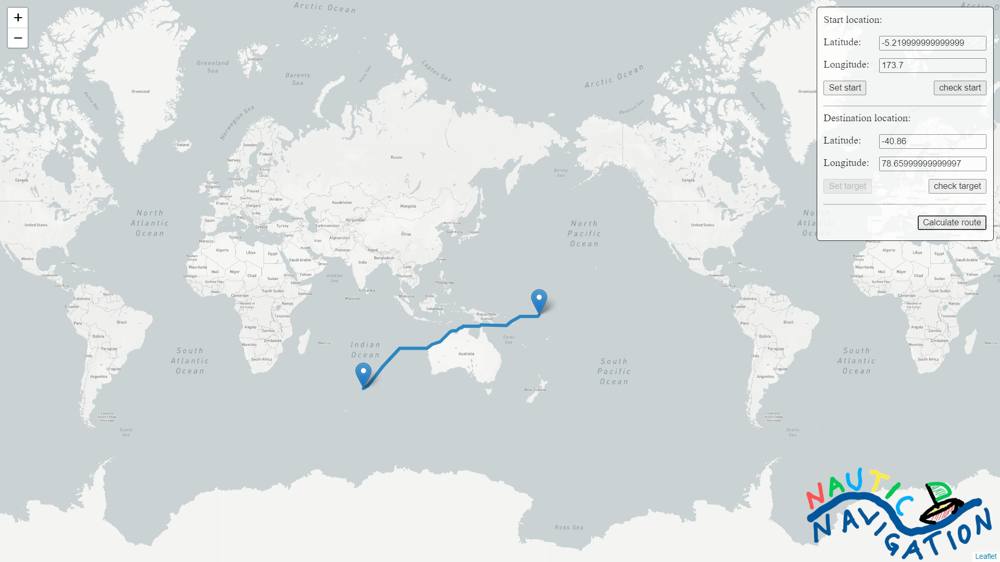
 <br/>

---

<br/>

### Run 2
**(1000 runs, 2.000.000 grid graph nodes)**<br/>
source (1000runs,grid_size=2000000,date=18.09;19.57.csv)

| Analysis      |              |                  |   |                 |              |                 |              |                  |               |
|---------------|--------------|------------------|---|-----------------|--------------|-----------------|--------------|------------------|---------------|
|               | Time speedup |  Nodes used less |   | t dijkstra avg. | t astar avg. |  total dijkstra |  total astar |  dijkstra routes |  astar routes |
| Average all   | 3.0265237    | 0.16416927       |   | 2.40409423      | 0.79434178   | 10400828        | 1707496      | 1000             | 1000          |
|               |              |                  |   |                 |              |                 |              |                  |               |
| Average found | 3.04224758   | 0.16333008       |   | 2.41134051      | 0.7926181    | 10432125        | 1703879      | 996              | 996           |

<br/>

### Best Case A star (in terms of node pulls)

| start lat |  start   long |  dest   lat |  dest   long |  dijkstra time |  astar   time |  dijsktra node pulls |   astar   node pulls |  dijkstra found |  astar   found |  index |
|-----------|---------------|-------------|--------------|----------------|---------------|----------------------|----------------------|-----------------|----------------|--------|
| 23.31     | -62.37        | 32.49       | -62.73       | 2.4018132      | 0.0154737     | 10432125             | 54                   | true            | true           | 775    |

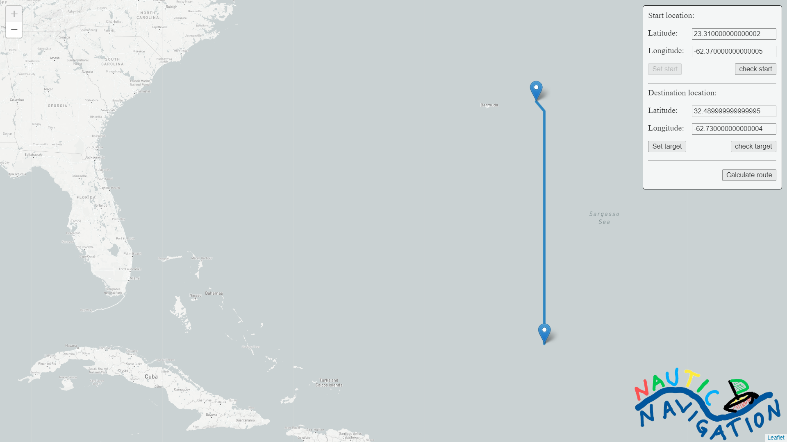
 <br/>

<br/>

### Worst case A star (in terms of node pulls)

| start lat |  start   long |  dest   lat |  dest   long |  dijkstra time |  astar   time |  dijsktra node pulls |   astar   node pulls |  dijkstra found |  astar   found |  index |
|-----------|---------------|-------------|--------------|----------------|---------------|----------------------|----------------------|-----------------|----------------|--------|
| -61.65    | 146.25        | 25.29       | -96.75       | 2.3890516      | 3.9453193     | 10432125             | 8752452              | true            | true           | 935    |

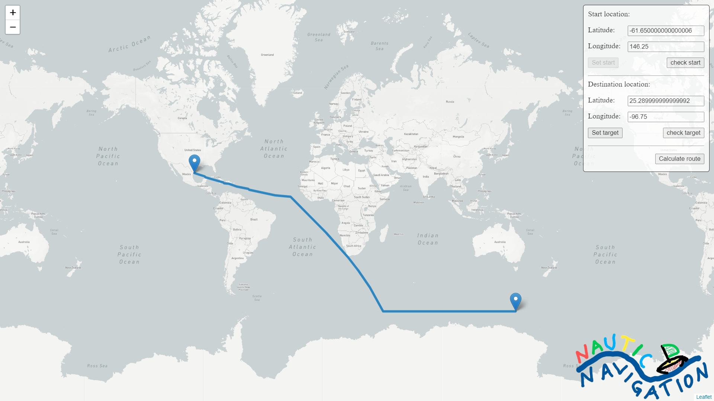
 <br/>

<br/>

### Median of A star (in terms of node pulls)

| start lat |  start   long |  dest   lat |  dest   long |  dijkstra time |  astar   time |  dijsktra node pulls |   astar   node pulls |  dijkstra found |  astar   found |  index |
|-----------|---------------|-------------|--------------|----------------|---------------|----------------------|----------------------|-----------------|----------------|--------|
| -51.93    | 101.97        | -62.91      | 1.71         | 2.4009995      | 0.4972607     | 10432125             | 1199228              | true            | true           | 9      |

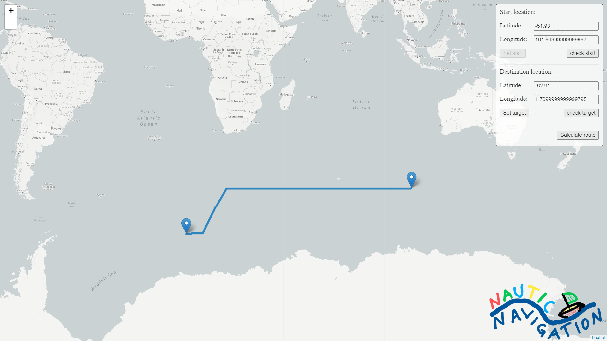
 <br/>

---

<br/>

### Run 3
**(1000 runs, 8.000.000 grid graph nodes)**<br/>
(source 1000runs,grid_size=8000000,date=19.09;03.26.csv)

| Analysis      |              |                  |   |                 |              |                 |              |                  |               |
|---------------|--------------|------------------|---|-----------------|--------------|-----------------|--------------|------------------|---------------|
|               | Time speedup |  Nodes used less |   | t dijkstra avg. | t astar avg. |  total dijkstra |  total astar |  dijkstra routes |  astar routes |
| Average all   | 2.95581833   | 0.17024893       |   | 11.3515217      | 3.84039897   | 41854149        | 7125624      | 1000             | 1000          |
|               |              |                  |   |                 |              |                 |              |                  |               |
| Average found | 2.99941957   | 0.16775219       |   | 11.3511014      | 3.78443268   | 41854149        | 7021125      | 997              | 997           |

<br/>

### Best Case A star (in terms of node pulls)

| start lat |  start   long |  dest   lat |  dest   long |  dijkstra time |  astar   time |  dijsktra node pulls |   astar   node pulls |  dijkstra found |  astar   found |  index |
|-----------|---------------|-------------|--------------|----------------|---------------|----------------------|----------------------|-----------------|----------------|--------|
| -58.005   | 144.675       | -60.615     | 144.405      | 11.2043713     | 0.0152742     | 41854149             | 66                   | true            | true           | 849    |

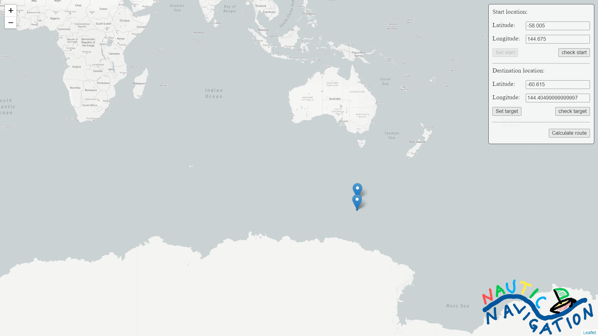
 <br/>

<br/>

### Worst case A star (in terms of node pulls)

| start lat |  start   long |  dest   lat |  dest   long |  dijkstra time |  astar   time |  dijsktra node pulls |   astar   node pulls |  dijkstra found |  astar   found |  index |
|-----------|---------------|-------------|--------------|----------------|---------------|----------------------|----------------------|-----------------|----------------|--------|
| -19.125   | 154.665       | 55.575      | 12.375       | 10.9503689     | 19.1131436    | 41854149             | 33517960             | true            | true           | 748    |

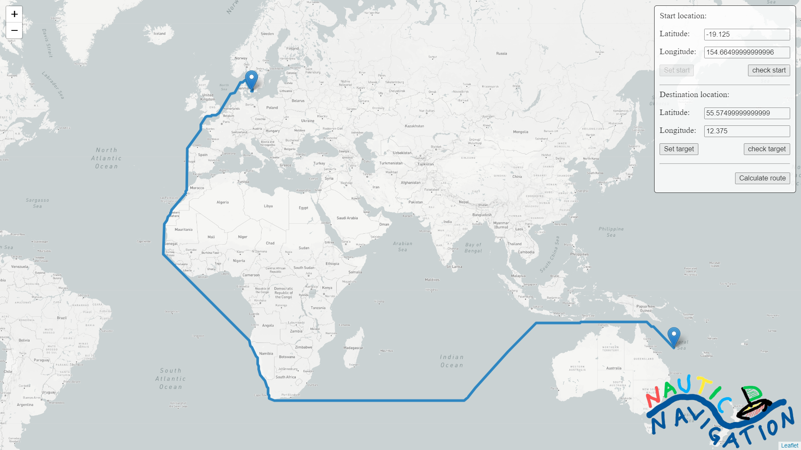
 <br/>

<br/>

### Median of A star (in terms of node pulls)

| start lat |  start   long |  dest   lat |  dest   long |  dijkstra time |  astar   time |  dijsktra node pulls |   astar   node pulls |  dijkstra found |  astar   found |  index |
|-----------|---------------|-------------|--------------|----------------|---------------|----------------------|----------------------|-----------------|----------------|--------|
| 87.615    | 49.455        | 54.675      | -179.505     | 11.6028939     | 1.9738589     | 41854149             | 5011196              | true            | true           | 593    |

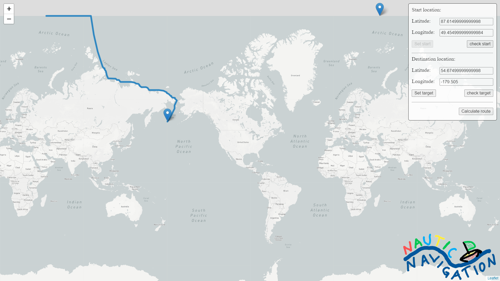
 <br/>

---

<br/>

## Discussion
- All three Benchmark runs show an average performance gain of about 200%. Also node pulls out of heap have overall descreased to about 20% of the dijkstra amount.
- The best-case runs show a straight line and have a very small time consumption
    - This is because the A star heuristic performs best on straight lines, as more paths can be excluded right away
- The worst case runs show extrem long curvy paths that lead to long running times.
    - running time of astar can be 50% larger as dijkstra. <br/>
    I assume that a more efficient heuristic calculation could solve that problem really well
    - Even in worst case the a star algorithm uses about 20% nodes less than dijkstra
- The median case is the most interesting one for me
    - They show reasonable complex routes but have a performance increase of about 500% to 600%

## Conclusion
I think, that the a star algorithms greatest bottleneck is the complexity of the heuristic function. During dijkstra computation the distance function doing a lot of transformation is not used, as we generate a lookuptable for all possible paths. This cannot be done during astar. I was unable to find a heuristic function that is cheaper and fullfiles the criteria to never overestimate cost.


---
# Project requirements

#### Task 1: Understand OSM Data Structures
- As a first step, we need to get to know how the data is organized inside OSM.we are primarily interested in “nodes” and “ways”.
    - Resources
        - the [OSM wiki](https://wiki.openstreetmap.org/wiki/Main_page) explains the [core data structures](https://wiki.openstreetmap.org/wiki/Elements) as well as interpretations of individual tags.
        - this [youtube-playlist](https://www.youtube.com/playlist?list=PLCE6296A33CF47955) explains the OSM primitives and tags with lots of examples
#### Task 2: Extract Coastlines from a PBF File
- Read in a PBF file and extract all coastlines contained in the file. You can start by just outputting them to console.  To see your results, save them as GeoJson and use geojson.io. Merge touching coastline ways to enablethe further processing in the following tasks. It makes sense to store the coastlines in a format that is easy to read for future use.
    - Resources
        - Download of OSM data by region from [geofabrik](https://download.geofabrik.de/index.html) (Antarctica is a good starting point)
        - [PBF Format](https://wiki.openstreetmap.org/wiki/PBF_Format)
        - Definition of the [coastline tag](https://wiki.openstreetmap.org/wiki/Coastline)
        - [Geojson format definition](https://geojson.org/)
        - [Geojson.io](http://geojson.io) a GeoJson visualization site
        - [Geojson styling guide](https://github.com/mapbox/simplestyle-spec/tree/master/1.1.0): adding CSS properties that are supported by geojson.io
        - Detailed [tagging information](https://wiki.openstreetmap.org/wiki/Tag:natural%3Dcoastline) for coastlines
 
#### Task 3: Distinguish between Water and Land
Implement the point in polygon test to determine if a certain position is inthe ocean (aka passable for ships). Be aware the latitude and longitude arenot coordinates on a plane. Use the spherical model of the earth to do your calculations.
- Resources
    - [Many calculations for lat long points](http://www.movable-type.co.uk/scripts/latlong.html)
    - [Calculations with lat long but converted into vectors first](http://www.movable-type.co.uk/scripts/latlong-vectors.html)
    - [In-polygon test with spherical polygons](https://link.springer.com/article/10.1007/BF00894449) (Uni network only)
    - https://en.wikipedia.org/wiki/Point_in_polygon
    - [Video with 3D animation of spherical vs vector coordinates](https://www.youtube.com/watch?v=FDyenWWlPdU)            
            
#### Task 4: Grid Graph
- Implement a grid graph representation which allows routing on the oceanscorresponding to the input. Use a bit vector to distinguish between accessible nodes (in the ocean) and non-accessible nodes (on land). Node position and edges should not explicitly be stored but be calculated on demand.

#### Task 5: Dijkstra’s Algorithm
Implement Dijkstra’s Algorithm for shortest paths on your grid data structure.

#### Task 6: Interactive Routing Front End
Add a GUI to your project. It should be possible to set start and end nodesas well as visualizing the route. The calculated distance should be displayedin your GUI.

#### Task 7: Speed Things Up
Implement a speed-up technique/heuristic for your project.

# Sources

#### Dependencies used (located in dependencies folder):
- Osmosis Pbf
    - Is used to parse PBF Files in java
    - Downloaded from https://mvnrepository.com/artifact/org.openstreetmap.osmosis/osmosis-pbf/0.46
    - Complete Osmosis Archive: https://github.com/openstreetmap/osmosis/releases/tag/0.47.4
    - Tutorials to use: https://neis-one.org/2017/10/processing-osm-data-java/
        
#### Tutorial used
- ##### Task 3
    - [Tutorial for vector matheatics](http://www.movable-type.co.uk/scripts/latlong-vectors.html)
    - [Point in polygon test](http://geomalgorithms.com/a03-_inclusion.html)
    - [Sorting Arrays with index List](https://stackoverflow.com/questions/4859261/get-the-indices-of-an-array-after-sorting)
    - https://howtodoinjava.com/sort/collections-sort/
        

